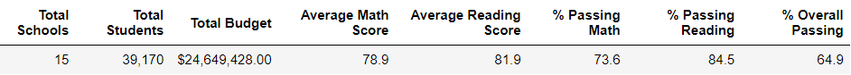
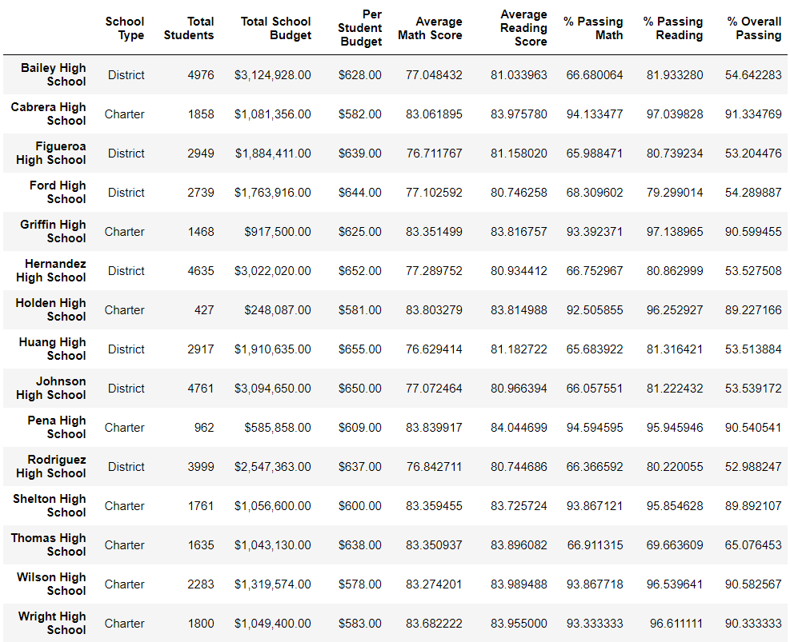
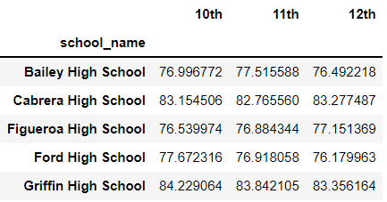
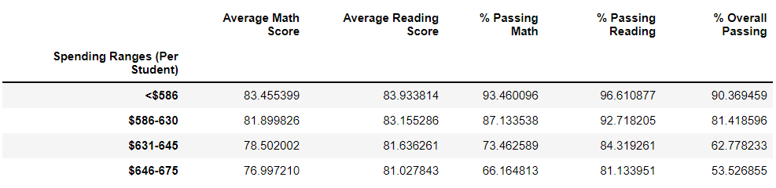
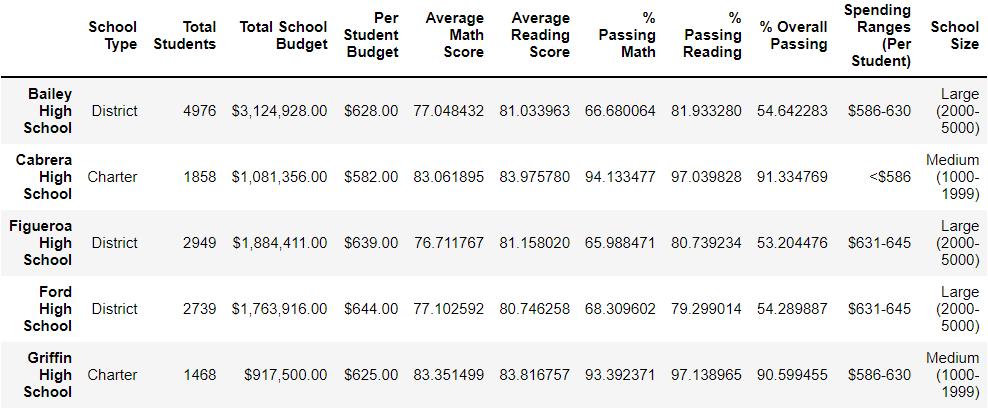
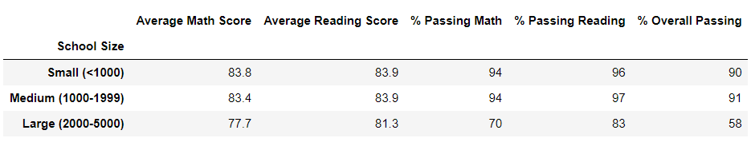
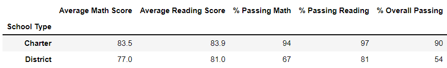

# School_District_Analysis

## Overview
The purpose of this analysis is to provide a summary of hihgh school student performance based on school budget, school size and school type. More specifically, this analysis focuses on student math and reading scores between grade levels and with the esxeption of the 9th grader scores at Thomas High School due to evidence of academic dishonestly. While the original data contains 9th grade math and reading scores, the code is written to filter out only those scores without removing all 9th grade data necessary for the full analysis. Once complete, we are able to create multiple dataframes providing usefull insight into the school district reports such as the top and bottom perorming schools.

## Results
- After removing 9th grade math and reading scores at Thomas High School, the district metrics change as follows:
  - Average math score drops from 79.0 to 78.9
  - Average reading score stayed the same
  - % passing math dropped from 75.0% to 73.6%
  - % passing reading dropped from 86.0% to 84.5%
  - % overall passing dropped from 65.0% to 64.9%

- After removing 9th grade math and reading scores at Thomas High School, the school's metrics change as follows: 
  - Average math score drops from 83.41 to 83.35
  - Average reading score improved from 83.85 to 83.90
  - % passing math dropped to from 93.27% to 66.91%
  - % passing reading dropped to from 97.30 to 69.66%
  - % overall passing dropped from 90.94% to 65.08%

- Thomas High School is the only school directly impacted by replacing 9th grade scores.

Math and reading scores by grade

Scores by school spending

Scores by school size

Scores by school type

## Summary
After replacing 9th grade scores at Thomas High School, the total student count decreased, the passing math rate dropped, the passing reading rate dropped and the overall passing percentage dropped from the individual school as well as the district.

